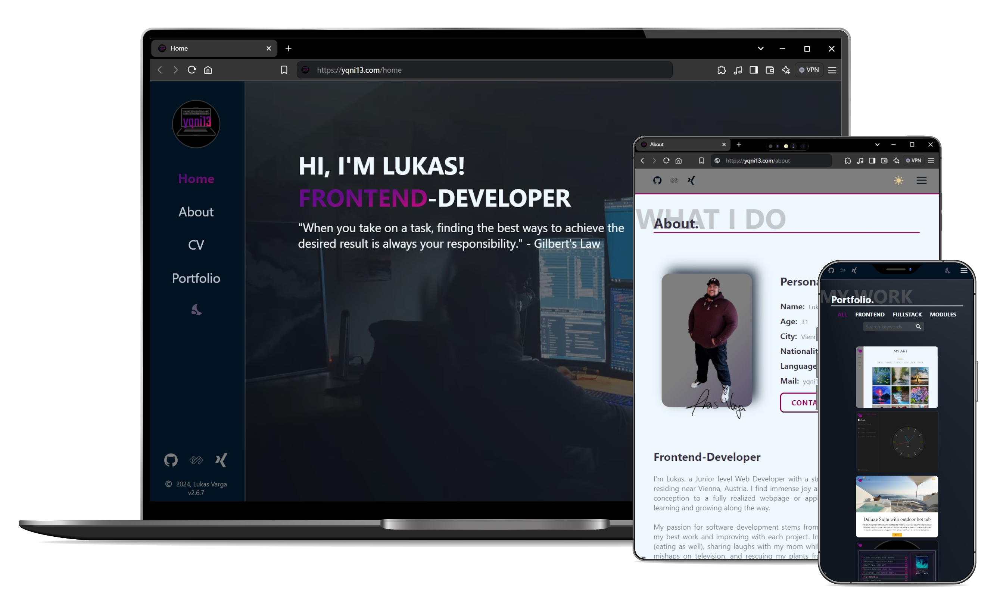
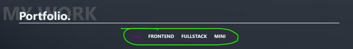
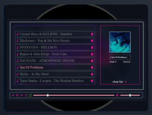
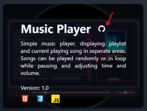
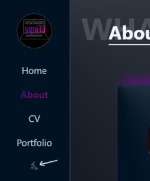
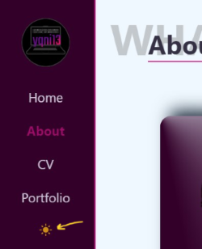

# yqni13 portfolio
$\texttt{\color{teal}{v1.3.1}}$

 

    

### Technology 

    
    
    
    &nbsp;&nbsp;
    

 

This project was generated with [Angular CLI](https://github.com/angular/angular-cli) version 17.3.6.

### <a href="https://yqni13.github.io/portfolio/home">TRY LIVE DEMO</a>

 

## How to:

### START

Get startet with `npm install` to create necessary modules and run `ng serve` to start on local dev server. Navigate to `http://localhost:4200/`. The application will automatically reload if you change any of the source files.

### BUILD & DEPLOY
To host the application on GitHub Pages directly from CLI, install the regarding package via `ng add angular-cli-ghpages`. See <a href="https://docs.angular.lat/guide/deployment">list of packages</a> for different hosting platforms deployed by command. Firstly, try the production build locally via command `ng serve --configuration production` to see, if there are differences between development and production build. Run `ng build --configuration production --base-href https://<username>.github.io/<projectname>` to create a deployable build in the folder /dist. For deployment, run `ng deploy --base-href=/<projectname>/` to push the necessary code automatically and trigger the workflow starting until project on 'https://username.github.io/projectname' is deployed. In contrast to my non-framework projects, the deployment will happen for angular projects on the 'gh-pages' branch due to the CLI-deployment instead of a 'production' branch.
  

## Features
<dl>
    <dd>:iphone: Responsive design 480px > width < 1440px via flexbox and media queries</dd>
    <dd>:book: Multi-Page Layout (main navigation and portfolio menu)</dd>
    <dd>:new_moon_with_face:/:sun_with_face: Dark/Light mode</dd>
    <dd>:art: Customized style</dd>
</dl>

## Portfolio

The portfolio component splits up to different $\textsf{\color{limegreen}{menu options}}$. The overview 'all' displays all projects regarding my work as a frontend-developer. Additionally I split the projects to different types like 'frontend'-only, 'fullstack' and smaller 'modules'.
 

    

  

Every project is displayed in card-style, containing a screenshot of the project user-interface and on hovering more information appear. The title, keywords, version and used technology icons will give a quick overview. Additionally, every project-card has a $\textsf{\color{red}{direct link}}$ to the regarding repository $\textsf{\color{red}{via github icon}}$ to open in a new tab.

    
    &nbsp;&nbsp;&nbsp;&nbsp;&nbsp;&nbsp;&nbsp;&nbsp;&nbsp;&nbsp;&nbsp;&nbsp;
    

  

## Theme settings

My portfolio comes with two theme settings: $\textsf{\color{gray}{Dark mode}}$ & $\textsf{\color{goldenrod}{Light mode}}$. The button to change the theme sits in the nav bar after the last menu option. If dark mode is enabled, the moon symbol is displayed or the sun for the enabled light mode. The local storage saves the setting, so navigating to another webpage and coming back later will still display the user-interface in the previously set theme (default setting: Dark mode).
 

    
    &nbsp;&nbsp;&nbsp;&nbsp;&nbsp;&nbsp;&nbsp;&nbsp;&nbsp;&nbsp;&nbsp;&nbsp;
    

  

## Testing

### Cross-browser testing

 |  |  |  |  | 
|:------:|:------:|:------:|:------:|:------:|:------:|
|Firefox | Chrome | Opera  | Edge   | DuckGo | Brave  |
|Yes     | Yes    | Yes    | Yes    | Yes    | Yes    |

 

## Updates

[list of all updates](src/docs/update_protocol.md)
### $\textsf{last\ update\ 1.1.2\ >>\ {\color{pink}1.3.1}}$

- $\textsf{\color{green}Change:}$ Navbar in mobile version is displayed on top instead on the left to give more space for the content in smaller viewports.
- $\textsf{\color{green}Change:}$ Data binding between components improved. Json data is now handled centralized in portfolio parent component and adapted with project-name as key for the regarding data object for easier maintenance.
- $\textsf{\color{red}Bugfix:}$ GitHub link in the projects 'Clock' and 'Rating' from 'Portfolio' component navigate to the regarding repository. [Before: Links were missing and navigating back to Portfolio page.]

 

### Aimed objectives for next $\textsf{\color{green}minor}$ update:
<dl>
    <dd>- error handling for images failing to load</dd>
    <dd>- create portfolio cards in html via *ngFor</dd>
    <dd>- customized error page</dd>
</dl>
 

### Aimed objectives for next $\textsf{\color{cyan}major}$ update:
<dl>
    <dd>- translation option to switch between german/english</dd>
    <dd>- responsive design > 1440px width</dd>
    <dd>- deploy a Web Application Manifest to make webpage a progressive web app (PWA)</dd>
</dl>