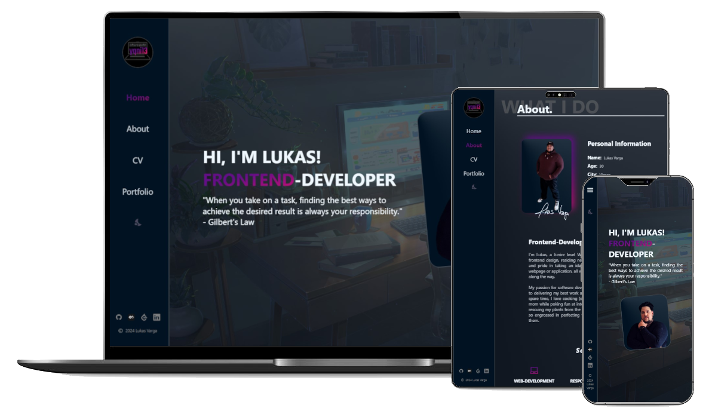

# yqni13 portfolio
$\texttt{\color{teal}{v1.0.0}}$

    

### Technology 

    
    
    Google Fonts

 

This project was generated with [Angular CLI](https://github.com/angular/angular-cli) version 17.3.6.

## Development server

Run `ng serve` for a dev server. Navigate to `http://localhost:4200/`. The application will automatically reload if you change any of the source files.

## Features
<dl>
    <dd>:book: Multi-Page Layout for main navigation and portfolio menu</dd>
    <dd>:iphone: Responsive design 480px > width < 1440px via flexbox and media queries</dd>
    <dd>:art: Customized style</dd>
    <dd>:new_moon_with_face:/:sun_with_face: Dark/Light mode</dd>
</dl>

## Updates

### Aimed objectives for next $\textsf{\color{green}minor}$ update:
<dl>
    <dd>- changing portfolio cards from description text to keywords</dd>
    <dd>- error handling for images failing to load</dd>
    <dd>- improve data binding</dd>
</dl>
 

### Aimed objectives for next $\textsf{\color{cyan}major}$ update:
<dl>
    <dd>- translation option to switch between german/english</dd>
    <dd>- responsive design > 1440px width</dd>
    <dd>- customized error page</dd>
</dl>