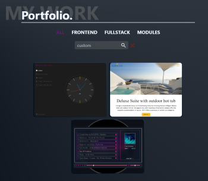
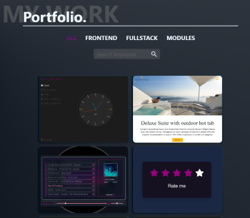

# yqni13 portfolio
$\texttt{\color{teal}{v2.5.5}}$


<br><br>

<div>
    
</div>

### Technology 

<div style="display:flex; align-items:center;">    
    
    
    &nbsp;&nbsp;
    
</div>
<br>

This project was generated with [Angular CLI](https://github.com/angular/angular-cli) version 17.3.6.

### <a href="https://yqni13.github.io/portfolio/home">TRY LIVE DEMO</a>

<br>

## How to:

### START

Get startet with `npm install` to create necessary modules and run `ng serve` to start on local dev server. Navigate to `http://localhost:4200/`. The application will automatically reload if you change any of the source files.

### BUILD & DEPLOY
Hosting an Angular project via GitHub-Pages needs a bit more effort. Firstly, install the regarding package via `ng add angular-cli-ghpages`. See <a href="https://docs.angular.lat/guide/deployment">list of packages</a> for different hosting platforms deployed by cli. Run tests locally to avoid failed deployments ([see 'Testing'](#testing)). To host the application on GitHub, a customized CI/CD workflow is used which automatically starts when code changes are merged into the 'master' branch. By adding 'deploy.yml' to .github/workflows folder (folder starts from same level as angular.json), the script will be executed in the workflow and run tests (ESLint and Angular unit-tests) before building the project and deploying it via angular-cli-ghpages on the 'gh-pages' branch. All commands to run are keys in 'deploy.yml' and full commands as value for the keys in 'package.json' to find.
<br><br>
Please consider for deploying the Angular project on GitHub via GitHub-Workflow, it is necessary to identify as user for the intern commits and to use a PAT (Personal Access Token, place as repository secret) for the git remote url (1x git remote config, 1x repo option deploy command) [see deploy.yml](.github/workflows/deploy.yml). 
<br><br>
build:prod >> `ng build --configuration production --base-href https://<username>.github.com/<projectname>`
<br>
deploy >> `npx angular-cli-ghpages --dir=dist/<projectname>/browser --repo=https://${{ secrets.PORTFOLIO_PAT }}@github.com/<username>/<projectname>.git --no-silent`
<br>

<br><br>

## Features
<dl>
    <dd>:iphone: Responsive design 480px > width < 1440px via flexbox and media queries</dd>
    <dd>:book: Multi-Page Layout (main navigation and portfolio menu)</dd>
    <dd>:new_moon_with_face:/:sun_with_face: Dark/Light mode</dd>
    <dd>:art: Customized style</dd>
    <dd>:mag: Customized filter search</dd>
    <dd>:busts_in_silhouette: Customized template (portfolio cards)</dd>
    <dd>:repeat: Using GitHub CI/CD workflow for automatic build & deployment</dd>
</dl>
<br>

## Portfolio

The portfolio component splits up to different $\textsf{\color{limegreen}{menu options}}$. The overview 'all' displays all projects regarding my work as a frontend-developer. Additionally I split the projects to different types like 'frontend'-only, 'fullstack' and smaller 'modules'.
<br>

<div align="center">
    
</div>
<br><br>

Besides the type filtering (all/frontend/fullstack/module), the portfolio projects can be filtered by keywords. The entered keyword is compared to the different properties like title, descriptional keywords, version and technology and respective results are displayed. The click on the magnifier or hitting key "enter" enables the filtration by the current keyword and with the red "x" all keywords are removed and filtering resets.
<br>

<div align="center">
    
    &nbsp;&nbsp;&nbsp;&nbsp;&nbsp;&nbsp;&nbsp;&nbsp;&nbsp;&nbsp;&nbsp;&nbsp;
    
</div>
<br><br>

Every project is displayed in card-style, containing a screenshot of the project user-interface and on hovering more information appear. The title, keywords, version and used technology icons will give a quick overview. Additionally, every project-card has a $\textsf{\color{red}{direct link}}$ to the regarding repository $\textsf{\color{red}{via github icon}}$ to open in a new tab.

<div align="center">
    
    &nbsp;&nbsp;&nbsp;&nbsp;&nbsp;&nbsp;&nbsp;&nbsp;&nbsp;&nbsp;&nbsp;&nbsp;
    
</div>
<br><br>

## Theme settings

My portfolio comes with two theme settings: $\textsf{\color{gray}{Dark mode}}$ & $\textsf{\color{goldenrod}{Light mode}}$. The button to change the theme sits in the nav bar after the last menu option. If dark mode is enabled, the moon symbol is displayed or the sun for the enabled light mode. The local storage saves the setting, so navigating to another webpage and coming back later will still display the user-interface in the previously set theme (default setting: Dark mode).
<br>

<div align="center">
    
    &nbsp;&nbsp;&nbsp;&nbsp;&nbsp;&nbsp;&nbsp;&nbsp;&nbsp;&nbsp;&nbsp;&nbsp;
    
</div>
<br><br>

## Testing

### Cross-browser testing

<center>

 |  |  |  |  | 
|:------:|:------:|:------:|:------:|:------:|:------:|
|Firefox | Chrome | Opera  | Edge   | DuckGo | Brave  |
|Yes     | Yes    | Yes    | Yes    | Yes    | Yes    |

</center>
<br>

### Angular ESLint

Added angular-eslint to project for next step of testing.<br>
Install ESLint global via node package manager: ```npm install -g eslint```<br>
Install ESLint local for angular project: ```ng add @angular-eslint/schematics```<br>
Run ESLint to list all current lint errors: ```npm run lint```<br>
To optimize work I use the VS Code extension 'ESLint' from Microsoft.

<br>

### Angular unit tests & other tests

Specified unit tests in xyz.component.spec.ts files or other tests are my last step of testing locally and in the CI/CD workflow. Run the following command in Powershell/Terminal:<br>
`ng test --browsers=ChromeHeadless --watch=false --code-coverage`

<br>

## Updates

[list of all updates](src/docs/update_protocol.md)
### $\textsf{last\ update\ 2.5.0\ >>\ {\color{pink}2.5.5}}$

- $\textsf{\color{red}Patch:}$ Addressing webpage stability issues: Disabled error alert because of fixed hosting.
- $\textsf{\color{red}Bugfix:}$ Default unit tests have all necessary declarations and imports. [Before: Template was not recognised as existing component because unit tests were missing the regarding declarations and imports.]
- $\textsf{\color{red}Bugfix:}$ Hosting works again (refreshing does not lead to error 404) and CI/CD pipeline adapted. [Before: Necessary options in deployment command missing. Customized workflow was missing.]
- $\textsf{\color{red}Bugfix:}$ Navigating to other page in menu resets scroll to top position (refresh gets back to current scroll position). [Before: Scroll position was used for next page so that it didn't start at top.]
- $\textsf{\color{red}Bugfix:}$ The component 'portfolio' shows the correct number of cards with the regarding data. [Before: Due to change of ESLint errors, json data was fetched by import but loaded single objects additional to default collection of objects. Needed adaption in import command to load data only from default.]

<br>

### Aimed objectives for next $\textsf{\color{green}minor}$ update:
<dl>
    <dd>- error handling for images failing to load</dd>
    <dd>- customized error page</dd>
    <dd>- css animations for extending/hiding elements</dd>
    <dd>- enable filtering portfolio cards with multiple keywords</dd>
</dl>
<br>

### Aimed objectives for next $\textsf{\color{cyan}major}$ update:
<dl>
    <dd>- translation option to switch between german/english</dd>
    <dd>- responsive design > 1440px width</dd>
    <dd>- deploy a Web Application Manifest to make webpage a progressive web app (PWA)</dd>
</dl>
