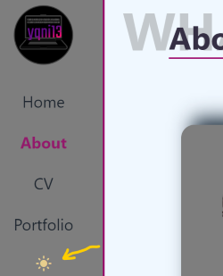

# yqni13 portfolio
$\texttt{\color{teal}{v1.0.0}}$

    

### Technology 

    
    
    Google Fonts

  

This project was generated with [Angular CLI](https://github.com/angular/angular-cli) version 17.3.6.

## Development server

Get startet with `npm install` and to start run `ng serve` for a dev server. Navigate to `http://localhost:4200/`. The application will automatically reload if you change any of the source files.
  

## Features
<dl>
    <dd>:iphone: Responsive design 480px > width < 1440px via flexbox and media queries</dd>
    <dd>:book: Multi-Page Layout (main navigation and portfolio menu)</dd>
    <dd>:new_moon_with_face:/:sun_with_face: Dark/Light mode</dd>
    <dd>:art: Customized style</dd>
</dl>

## Portfolio

The portfolio component splits up to different $\textsf{\color{limegreen}{menu options}}$. The overview "all" displays all projects regarding my work as a frontend-developer. Additionally I split the projects to different types like "frontend"-only, "fullstack" and smaller "modules".
 

    

  

Every project is displayed in card-style, containing a screenshot of the project user-interface and on hovering more information appear. The title, keywords, version and used technology icons will give a quick overview. Additionally, every project-card has a $\textsf{\color{red}{direct link}}$ to the regarding repository $\textsf{\color{red}{via github icon}}$ to open in a new tab.

    
    &nbsp;&nbsp;&nbsp;&nbsp;&nbsp;&nbsp;&nbsp;&nbsp;&nbsp;&nbsp;&nbsp;&nbsp;
    

  

## Theme settings

My portfolio comes with two theme settings: $\textsf{\color{gray}{Dark mode}}$ & $\textsf{\color{goldenrod}{Light mode}}$. The button to change the theme sits in the nav bar after the last menu option. If dark mode is enabled, the moon symbol is displayed or the sun for the enabled light mode. The local storage saves the setting, so navigating to another webpage and coming back later will still display the user-interface in the previously set theme (default setting: Dark mode).
 

    
    &nbsp;&nbsp;&nbsp;&nbsp;&nbsp;&nbsp;&nbsp;&nbsp;&nbsp;&nbsp;&nbsp;&nbsp;
    

## Updates

### Aimed objectives for next $\textsf{\color{green}minor}$ update:
<dl>
    <dd>- changing portfolio cards from description text to keywords</dd>
    <dd>- error handling for images failing to load</dd>
    <dd>- improve data binding</dd>
    <dd>- create portfolio cards in html via *ngFor</dd>
</dl>
 

### Aimed objectives for next $\textsf{\color{cyan}major}$ update:
<dl>
    <dd>- translation option to switch between german/english</dd>
    <dd>- responsive design > 1440px width</dd>
    <dd>- customized error page</dd>
</dl>