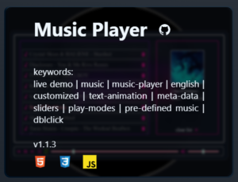

# yqni13 portfolio
$\texttt{\color{teal}{v2.3.2}}$

 

$\texttt{\color{red}{!\ !\ !\ }}$ 
<b>Currently deployment via angular-cli-ghpages does NOT work for this portfolio. That is why the deployment is running on the 'production' branch instead of the 'gh-pages' branch, which apparently DOES NOT SUPPORT angular multi page applications. Refreshing the webpage will lead to 404 and homepage must be navigated to https://yqni13.github.io/portfolio again. The new version is build into '/docs' folder (hosting is set to check all necessary files in there) and normally merged into 'production' branch. Please note that I am working on this issue parallel to some security vulnerabilities and updating to Angular 18.
</b> 
$\texttt{\color{red}{!\ !\ !\ }}$
  

    

### Technology 

    
    
    
    &nbsp;&nbsp;
    

 

This project was generated with [Angular CLI](https://github.com/angular/angular-cli) version 17.3.6.

### <a href="https://yqni13.github.io/portfolio/home">TRY LIVE DEMO</a>

 

## How to:

### START

Get startet with `npm install` to create necessary modules and run `ng serve` to start on local dev server. Navigate to `http://localhost:4200/`. The application will automatically reload if you change any of the source files.

### BUILD & DEPLOY
To host the application on GitHub Pages directly from CLI, install the regarding package via `ng add angular-cli-ghpages`. See <a href="https://docs.angular.lat/guide/deployment">list of packages</a> for different hosting platforms deployed by command. Firstly, try the production build locally via command `ng serve --configuration production` to see, if there are differences between development and production build. Run `ng build --configuration production --base-href https://<username>.github.io/<projectname>` to create a deployable build in the folder /dist. For deployment, run `ng deploy --base-href=/<projectname>/` to push the necessary code automatically and trigger the workflow starting until project on 'https://username.github.io/projectname' is deployed. In contrast to my non-framework projects, the deployment will happen for angular projects on the 'gh-pages' branch due to the CLI-deployment instead of a 'production' branch.
  

## Features
<dl>
    <dd>:iphone: Responsive design 480px > width < 1440px via flexbox and media queries</dd>
    <dd>:book: Multi-Page Layout (main navigation and portfolio menu)</dd>
    <dd>:new_moon_with_face:/:sun_with_face: Dark/Light mode</dd>
    <dd>:art: Customized style</dd>
    <dd>:mag: Customized filter search</dd>
    <dd>:busts_in_silhouette: Customized template (portfolio cards)</dd>
</dl>
 

## Portfolio

The portfolio component splits up to different $\textsf{\color{limegreen}{menu options}}$. The overview 'all' displays all projects regarding my work as a frontend-developer. Additionally I split the projects to different types like 'frontend'-only, 'fullstack' and smaller 'modules'.
 

    

  

Besides the type filtering (all/frontend/fullstack/module), the portfolio projects can be filtered by keywords. The entered keyword is compared to the different properties like title, descriptional keywords, version and technology and respective results are displayed. The click on the magnifier or hitting key "enter" enables the filtration by the current keyword and with the red "x" all keywords are removed and filtering resets.
 

    
    &nbsp;&nbsp;&nbsp;&nbsp;&nbsp;&nbsp;&nbsp;&nbsp;&nbsp;&nbsp;&nbsp;&nbsp;
    

  

Every project is displayed in card-style, containing a screenshot of the project user-interface and on hovering more information appear. The title, keywords, version and used technology icons will give a quick overview. Additionally, every project-card has a $\textsf{\color{red}{direct link}}$ to the regarding repository $\textsf{\color{red}{via github icon}}$ to open in a new tab.

    
    &nbsp;&nbsp;&nbsp;&nbsp;&nbsp;&nbsp;&nbsp;&nbsp;&nbsp;&nbsp;&nbsp;&nbsp;
    

  

## Theme settings

My portfolio comes with two theme settings: $\textsf{\color{gray}{Dark mode}}$ & $\textsf{\color{goldenrod}{Light mode}}$. The button to change the theme sits in the nav bar after the last menu option. If dark mode is enabled, the moon symbol is displayed or the sun for the enabled light mode. The local storage saves the setting, so navigating to another webpage and coming back later will still display the user-interface in the previously set theme (default setting: Dark mode).
 

    
    &nbsp;&nbsp;&nbsp;&nbsp;&nbsp;&nbsp;&nbsp;&nbsp;&nbsp;&nbsp;&nbsp;&nbsp;
    

  

## Testing

### Cross-browser testing

 |  |  |  |  | 
|:------:|:------:|:------:|:------:|:------:|:------:|
|Firefox | Chrome | Opera  | Edge   | DuckGo | Brave  |
|Yes     | Yes    | Yes    | Yes    | Yes    | Yes    |

 

## Updates

[list of all updates](src/docs/update_protocol.md)
### $\textsf{last\ update\ 2.2.2\ >>\ {\color{pink}2.3.?}}$

- $\textsf{\color{red}Bugfix:}$ Demo text. [Before: Demo text.]
- $\textsf{\color{red}Bugfix:}$ Only the message part from an issue warning has now a background-color and rest of it has blurred effect to see scheme of webpage. [Before: The warning message would cover the complete display and mislead the user to thinking that the webpage would not be working at all.]
- $\textsf{\color{red}Bugfix:}$ Clicking on the logo navigates to the 'home' component and closes the unfolded navbar in the mobile version. [Before: The logo was missing logic to close the unfolded navbar in the mobile version, so it navigated to the 'home' component but didn't close.]

 

### Aimed objectives for next $\textsf{\color{green}minor}$ update:
<dl>
    <dd>- error handling for images failing to load</dd>
    <dd>- customized error page</dd>
    <dd>- css animations for extending/hiding elements</dd>
    <dd>- enable filtering portfolio cards with multiple keywords</dd>
</dl>
 

### Aimed objectives for next $\textsf{\color{cyan}major}$ update:
<dl>
    <dd>- translation option to switch between german/english</dd>
    <dd>- responsive design > 1440px width</dd>
    <dd>- deploy a Web Application Manifest to make webpage a progressive web app (PWA)</dd>
</dl>